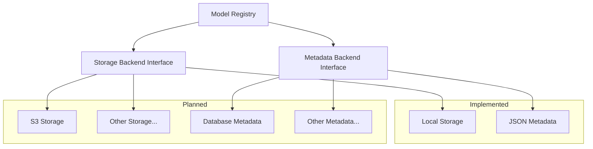

# Model Management Module

The Model Management module provides a centralized repository for storing, versioning, and managing machine learning models with pluggable storage backends.

## 🏗️ Architecture

### Abstract Storage Design

The module follows a **clean architecture** with abstract interfaces that allow switching storage backends without changing business logic.



## 🧩 Components

### 1. Storage Backends

Abstract interface for model storage with concrete implementations:

#### `StorageBackend` (Abstract)
```python
class StorageBackend(ABC):
    @abstractmethod
    def save_model(self, model: Any, path: str) -> None: ...
    
    @abstractmethod
    def load_model(self, path: str) -> Any: ...
    
    @abstractmethod
    def delete_model(self, path: str) -> None: ...
```

#### `LocalStorageBackend` ✅ Implemented
- Stores models on local filesystem using pickle
- Automatic directory creation
- File size tracking

#### `S3StorageBackend` 🚧 Planned
- Cloud storage for production deployments
- Supports S3-compatible storage systems

### 2. Metadata Backends

Abstract interface for metadata storage:

#### `MetadataBackend` (Abstract)
```python
class MetadataBackend(ABC):
    @abstractmethod
    def save_metadata(self, metadata: Dict) -> None: ...
    
    @abstractmethod
    def load_metadata(self) -> Dict: ...
```

#### `JSONMetadataBackend` ✅ Implemented
- Stores metadata in JSON files
- Human-readable format
- Simple file-based persistence

#### `DatabaseMetadataBackend` 🚧 Planned
- SQL database storage for production
- Better querying and indexing capabilities

### 3. Model Registry

Main interface for model operations:

```python
class ModelRegistry:
    def save_model(self, model, name, description="", tags=None) -> str
    def load_model(self, name, version=None) -> Any
    def delete_model(self, name, version=None) -> None
    def list_models(self) -> Dict
    def get_model_versions(self, name) -> List[Dict]
```

## 🚀 Usage Examples

### Basic Usage

```python
from model_management import create_registry

# Create registry with local storage
registry = create_registry("local", path="./models")

# Save a model
def my_model(x):
    return x * 2 + 1

version = registry.save_model(
    my_model, 
    "linear_model", 
    "Simple linear predictor",
    tags={"type": "function", "complexity": "low"}
)

# Load the model
loaded_model = registry.load_model("linear_model")
result = loaded_model(5)  # Returns 11
```

### Working with Versions

```python
# Save multiple versions
registry.save_model(model_v1, "classifier", "Initial version")
registry.save_model(model_v2, "classifier", "Improved accuracy")
registry.save_model(model_v3, "classifier", "Latest with new features")

# Load specific version
old_model = registry.load_model("classifier", version="1")

# Load latest version (default)
latest_model = registry.load_model("classifier")

# Get version information
versions = registry.get_model_versions("classifier")
latest_version = registry.get_latest_version("classifier")
```

### Model Information and Metadata

```python
# List all models
all_models = registry.list_models()

for name, versions in all_models.items():
    print(f"Model: {name}")
    for version_info in versions:
        print(f"  v{version_info['version']}: {version_info['description']}")
        print(f"    Created: {version_info['created_at']}")
        print(f"    Size: {version_info['file_size']} bytes")
        print(f"    Tags: {version_info['tags']}")
```

### Custom Storage Configuration

```python
from model_management import ModelRegistry, LocalStorageBackend, JSONMetadataBackend

# Custom backend configuration
storage = LocalStorageBackend("/custom/model/path")
metadata = JSONMetadataBackend("/custom/metadata.json")

registry = ModelRegistry(storage, metadata)
```

## 🔧 Configuration

### Factory Function

The `create_registry()` function provides easy configuration:

```python
# Local storage (default)
registry = create_registry("local")

# Custom local path
registry = create_registry("local", path="/my/models", metadata_path="/my/registry.json")

# Future: S3 storage
# registry = create_registry("s3", bucket="my-models", region="us-east-1")
```

## 📁 File Structure

The model registry creates the following structure:

```
models/
├── registry.json                 # Metadata file
├── linear_model/
│   ├── v1/
│   │   └── model.pkl             # Model file version 1
│   └── v2/
│       └── model.pkl             # Model file version 2
└── classifier/
    └── v1/
        └── model.pkl             # Classifier model
```

### Metadata Format

The `registry.json` file contains structured metadata:

```json
{
  "linear_model": [
    {
      "name": "linear_model",
      "version": "1",
      "description": "Simple linear predictor",
      "tags": {"type": "function", "complexity": "low"},
      "created_at": "2024-01-15T10:30:00.000000",
      "storage_path": "linear_model/v1/model.pkl",
      "file_size": 245
    }
  ]
}
```

## 🎯 Key Features

### ✅ Implemented Features

- **Automatic Versioning**: Sequential version numbers (1, 2, 3...)
- **Model Metadata**: Description, tags, creation time, file size
- **Pluggable Storage**: Abstract backend system
- **Version Management**: Load specific versions or latest
- **Model Listing**: Browse all models and versions
- **Local Storage**: Filesystem-based storage backend
- **JSON Metadata**: File-based metadata storage

### 🚧 Planned Features

- **S3 Storage Backend**: Cloud storage support
- **Database Metadata**: SQL database for metadata
- **Model Validation**: Automatic model testing before save
- **Model Lineage**: Track model relationships and dependencies
- **Performance Metrics**: Store model performance data
- **Model Staging**: Development → Staging → Production workflow
- **Model Comparison**: Compare different model versions
- **Search and Filtering**: Query models by tags, performance, etc.

## 🔍 Error Handling

The registry provides clear error messages:

```python
try:
    model = registry.load_model("nonexistent_model")
except ValueError as e:
    print(f"Error: {e}")  # Model 'nonexistent_model' not found in registry

try:
    model = registry.load_model("my_model", version="999")
except ValueError as e:
    print(f"Error: {e}")  # Model 'my_model' version '999' not found
```

## 🧪 Testing

Run the example to test the module:

```bash
python model_management/example.py
```

Expected output:
```
🚀 Model Registry Example
==================================================

📝 Saving models...
✅ Model 'linear_predictor' version 1 saved successfully
✅ Model 'simple_classifier' version 1 saved successfully
✅ Model 'linear_predictor' version 2 saved successfully

📋 Listing all models:
🎯 linear_predictor:
  v1: Simple linear function
  v2: Improved linear function with new coefficients

🎯 simple_classifier:
  v1: Threshold-based classifier

✅ Example completed successfully!
```

## 🚀 Next Steps

1. **Implement S3 Backend**: Add cloud storage support
2. **Add Database Metadata**: Use SQL for better querying
3. **Model Validation**: Automatic testing before save
4. **Performance Tracking**: Store model metrics
5. **Web API**: REST API for model management
6. **Model Staging**: Implement deployment stages

This model management module provides a solid foundation for MLOps model lifecycle management with room for future enhancements.