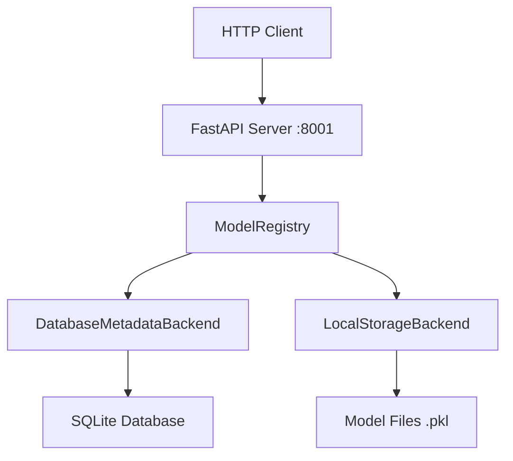

# REST API Backend

The MLOps Model Management System provides a **FastAPI-based REST API** for accessing model registry functionality via HTTP endpoints.

## 🚀 Overview

The REST API wraps our model registry system, providing web-based access to:
- View all models and their metadata
- Get model statistics and counts  
- Query models from SQLite database
- Access via browser, curl, Postman, or any HTTP client

## 🏗️ Architecture



## 🛠️ Implementation

### Technology Stack
- **FastAPI**: Modern Python web framework
- **Uvicorn**: ASGI server
- **Pydantic**: Data validation
- **SQLite**: Database backend
- **JSON**: Response format

### Project Structure
```
api/
├── main.py                 # FastAPI application
└── api_models/            # API model storage (created automatically)
    ├── registry.db        # SQLite database
    └── model_name/        # Model files
        └── v1/
            └── model.pkl
```

## 📡 API Endpoints

### Base URL
```
http://localhost:8001
```

### Available Endpoints

#### 1. Root Endpoint
**GET** `/`
```json
{
  "message": "Model Registry API",
  "endpoints": ["/models", "/models/count", "/models/stats"]
}
```

#### 2. List All Models  
**GET** `/models`

**Response:**
```json
{
  "models": {
    "linear_predictor": [
      {
        "name": "linear_predictor",
        "version": "1", 
        "description": "Simple linear regression model",
        "tags": {
          "type": "regression",
          "complexity": "low",
          "author": "data_team"
        },
        "created_at": "2025-08-19T08:15:23.456789",
        "file_size": 245,
        "storage_path": "linear_predictor/v1/model.pkl"
      }
    ],
    "binary_classifier": [
      {
        "name": "binary_classifier",
        "version": "1",
        "description": "Simple threshold classifier",
        "tags": {
          "type": "classification", 
          "threshold": "0.3",
          "author": "data_team"
        },
        "created_at": "2025-08-19T08:15:24.123456",
        "file_size": 189,
        "storage_path": "binary_classifier/v1/model.pkl"
      }
    ]
  }
}
```

#### 3. Model Count
**GET** `/models/count`

**Response:**
```json
{
  "total_models": 2,
  "total_versions": 2
}
```

#### 4. Registry Statistics
**GET** `/models/stats`

**Response:**
```json
{
  "summary": {
    "total_models": 2,
    "total_versions": 2, 
    "total_size_bytes": 434,
    "total_size_mb": 0.0
  },
  "models": {
    "linear_predictor": {
      "version_count": 1,
      "total_size_bytes": 245,
      "total_size_mb": 0.0,
      "latest_version": "1",
      "latest_created_at": "2025-08-19T08:15:23.456789"
    }
  }
}
```

## 🧪 Testing the API

### Using Browser
Navigate to these URLs in your browser:
- http://localhost:8001/
- http://localhost:8001/models
- http://localhost:8001/models/count
- http://localhost:8001/models/stats
- http://localhost:8001/docs (Interactive API documentation)

### Using curl
```bash
# Get all models
curl http://localhost:8001/models

# Get model count
curl http://localhost:8001/models/count

# Get statistics  
curl http://localhost:8001/models/stats
```

### Using Python requests
```python
import requests

# Get all models
response = requests.get('http://localhost:8001/models')
models = response.json()
print(f"Found {len(models['models'])} models")

# Get statistics
response = requests.get('http://localhost:8001/models/stats')
stats = response.json()
print(f"Total models: {stats['summary']['total_models']}")
```

## 🚀 Running the API

### Prerequisites
```bash
pip install fastapi uvicorn
```

### Start the Server
```bash
# From the api directory
cd api
python main.py

# Or using uvicorn directly
uvicorn main:app --host 127.0.0.1 --port 8001
```

### Server Output
```
INFO:     Started server process [12345]
INFO:     Waiting for application startup.  
INFO:     Application startup complete.
INFO:     Uvicorn running on http://127.0.0.1:8001 (Press CTRL+C to quit)
```

## 🔧 Configuration

### Database Backend
The API uses the SQLite database backend by default:
```python
registry = create_registry("database", 
                          path="../api_models", 
                          db_path="../api_models/registry.db")
```

### Custom Configuration
```python
# In main.py - modify get_registry() function
def get_registry():
    global registry
    if registry is None:
        # Option 1: JSON backend
        registry = create_registry("local", 
                                  path="../models",
                                  metadata_path="../models/registry.json")
        
        # Option 2: Custom database path
        registry = create_registry("database",
                                  path="/custom/models",
                                  db_path="/custom/registry.db")
    return registry
```

## 📚 Interactive Documentation

FastAPI automatically generates interactive API documentation:

### Swagger UI
- **URL**: http://localhost:8001/docs
- **Features**: Test endpoints directly in browser
- **Try it out**: Click endpoints and execute requests

### ReDoc
- **URL**: http://localhost:8001/redoc  
- **Features**: Clean, readable API documentation

## 🔍 Error Handling

The API provides clear error responses:

```json
{
  "detail": "Model 'nonexistent_model' not found"
}
```

### Common HTTP Status Codes
- **200**: Success
- **404**: Model not found
- **500**: Internal server error

## 🎯 Key Benefits

### For Development
- ✅ **Quick Testing**: Test model registry via browser
- ✅ **No Client Code**: Use curl or browser directly
- ✅ **JSON Responses**: Easy to parse and inspect
- ✅ **Auto Documentation**: Swagger/ReDoc integration

### For Integration
- ✅ **Language Agnostic**: Any language can call HTTP endpoints
- ✅ **Web Dashboard**: Can build web UI on top of API
- ✅ **Microservices**: API can be part of larger system
- ✅ **Monitoring**: HTTP logs and metrics

### For Production
- ✅ **Scalable**: Can run multiple API instances
- ✅ **Load Balancer**: Standard HTTP load balancing
- ✅ **Authentication**: Can add JWT/OAuth easily
- ✅ **Rate Limiting**: Standard web rate limiting

## 🚧 Planned Enhancements

### Phase 1: Read-Only API ✅ (Current)
- View models and metadata
- Get statistics and counts
- Interactive documentation

### Phase 2: Full CRUD API 🚧 (Planned)
- Register/upload new models
- Update model metadata
- Delete models and versions
- Model search and filtering

### Phase 3: Advanced Features 🎯 (Future)
- Authentication and authorization
- Model download endpoints
- Batch operations
- Webhooks and notifications

## 🔐 Security Considerations

### Current (Development)
- No authentication required
- Local access only (127.0.0.1)
- Read-only operations

### Production Recommendations
- Add API key authentication
- Enable HTTPS/TLS
- Rate limiting
- Input validation
- CORS configuration

This REST API provides a solid foundation for building web-based MLOps tools and integrating model management into larger systems.