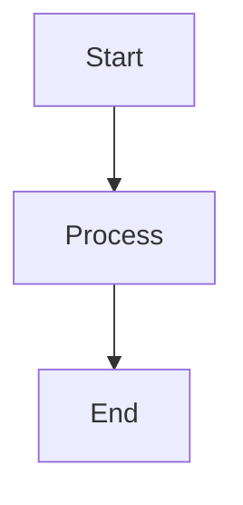

# Documentation Development Guide

This guide explains how to set up, build, and maintain the MLOps Management System documentation site.

## 📋 Prerequisites

- **Python 3.8+** installed on your system
- **Git** for version control
- A text editor or IDE for editing markdown files

## 🚀 Quick Start

### 1. Initial Setup

Clone the repository and navigate to the project directory:

```bash
cd /path/to/claude_code_project
```

### 2. Create Virtual Environment

```bash
python3 -m venv venv
```

### 3. Activate Virtual Environment

**On macOS/Linux:**
```bash
source venv/bin/activate
```

**On Windows:**
```cmd
venv\Scripts\activate
```

### 4. Install Dependencies

```bash
pip install mkdocs mkdocs-material mkdocs-mermaid2-plugin
```

### 5. Build Documentation

```bash
mkdocs build
```

### 6. Serve Documentation Locally

```bash
mkdocs serve
```

The documentation will be available at: http://127.0.0.1:8000

## 🛠️ Development Workflow

### Daily Development

1. **Activate the virtual environment:**
   ```bash
   source venv/bin/activate  # macOS/Linux
   # or
   venv\Scripts\activate     # Windows
   ```

2. **Start the development server:**
   ```bash
   mkdocs serve
   ```

3. **Edit markdown files** in the `docs/` directory

4. **View changes** automatically at http://127.0.0.1:8000

5. **Deactivate when done:**
   ```bash
   deactivate
   ```

### Adding New Pages

1. Create a new `.md` file in the appropriate `docs/` subdirectory
2. Add the page to the `nav` section in `mkdocs.yml`:
   ```yaml
   nav:
     - Home: index.md
     - Architecture:
       - Overview: architecture/index.md
       - New Page: architecture/new-page.md  # Add here
   ```

### Using Mermaid Diagrams

Wrap Mermaid diagram code in triple backticks with `mermaid` language specification:

````markdown

````

## 📁 Project Structure

```
claude_code_project/
├── docs/                          # Documentation source files
│   ├── index.md                   # Homepage
│   ├── architecture/
│   │   └── index.md              # Architecture documentation
│   ├── components/
│   │   └── index.md              # Components documentation
│   ├── workflows/
│   │   └── ml-lifecycle.md       # Workflow documentation
│   ├── development/
│   │   └── index.md              # This development guide
│   └── stylesheets/
│       └── extra.css             # Custom CSS styles
├── mkdocs.yml                     # MkDocs configuration
├── build_docs.sh                 # Build script
├── .gitignore                     # Git ignore rules
├── venv/                          # Virtual environment (ignored by git)
└── site/                          # Built documentation (ignored by git)
```

## ⚙️ Configuration

### MkDocs Configuration (`mkdocs.yml`)

Key configuration sections:

- **`site_name`**: The title of your documentation
- **`theme`**: Material theme configuration with color schemes
- **`nav`**: Navigation structure and page organization
- **`markdown_extensions`**: Enabled markdown features
- **`plugins`**: Additional functionality (search, mermaid)

### Custom Styling

Edit `docs/stylesheets/extra.css` to customize the appearance:

```css
/* Example: Change primary color */
:root {
  --md-primary-fg-color: #2196F3;
}

/* Example: Custom component styling */
.component-card {
  border: 1px solid var(--md-default-fg-color--lighter);
  padding: 1rem;
  border-radius: 0.2rem;
}
```

## 🔧 Build Commands Reference

### Essential Commands

| Command | Description |
|---------|-------------|
| `mkdocs build` | Build static site to `site/` directory |
| `mkdocs serve` | Start development server with auto-reload |
| `mkdocs serve --dev-addr=0.0.0.0:8000` | Serve on all interfaces |
| `mkdocs --help` | Show all available commands |

### Build Script

Use the provided build script for automated setup and building:

```bash
./build_docs.sh
```

This script will:
1. Create virtual environment if needed
2. Install all dependencies
3. Build the documentation
4. Show deployment instructions

## 🚀 Deployment Options

### Option 1: Static File Hosting

After building with `mkdocs build`, deploy the `site/` directory to:
- **Netlify**: Drag and drop the `site/` folder
- **Vercel**: Connect your Git repository
- **AWS S3**: Upload `site/` contents to S3 bucket
- **GitHub Pages**: Use `mkdocs gh-deploy` command

### Option 2: GitHub Pages (Automated)

```bash
mkdocs gh-deploy
```

This command:
1. Builds the documentation
2. Pushes to `gh-pages` branch
3. Enables GitHub Pages automatically

### Option 3: Docker Deployment

Create a `Dockerfile`:

```dockerfile
FROM nginx:alpine
COPY site/ /usr/share/nginx/html/
EXPOSE 80
CMD ["nginx", "-g", "daemon off;"]
```

Build and run:
```bash
docker build -t mlops-docs .
docker run -p 8080:80 mlops-docs
```

## 🔍 Troubleshooting

### Common Issues

**Issue**: `ModuleNotFoundError: No module named 'mkdocs'`
```bash
# Solution: Activate virtual environment first
source venv/bin/activate
pip install mkdocs mkdocs-material mkdocs-mermaid2-plugin
```

**Issue**: Mermaid diagrams not rendering
```bash
# Solution: Install mermaid plugin
pip install mkdocs-mermaid2-plugin
```

**Issue**: Changes not reflecting in browser
- Hard refresh the browser (Ctrl+F5 or Cmd+Shift+R)
- Check if `mkdocs serve` is running
- Verify file is saved

**Issue**: Navigation links broken
- Check `mkdocs.yml` nav structure
- Ensure file paths match exactly
- Use relative paths without leading slashes

### Validation Commands

```bash
# Check configuration
mkdocs build --verbose

# Validate links
mkdocs build --strict

# Check for unused files
mkdocs build --clean
```

## 📝 Content Guidelines

### Markdown Best Practices

- Use descriptive headings with proper hierarchy (`#`, `##`, `###`)
- Include code syntax highlighting with language specification
- Add alt text for images: ``
- Use relative links for internal pages
- Break up long content with subheadings and lists

### Mermaid Diagram Guidelines

- Keep diagrams simple and focused
- Use consistent styling and colors
- Include diagram titles and labels
- Test diagrams in the live preview

### Writing Style

- Use clear, concise language
- Include practical examples
- Add code snippets where helpful
- Use admonitions for important notes:

```markdown
!!! note "Important"
    This is an important note for users.

!!! warning "Caution"
    This is a warning message.
```

## 🔄 Maintenance

### Regular Tasks

1. **Update dependencies** monthly:
   ```bash
   source venv/bin/activate
   pip install --upgrade mkdocs mkdocs-material mkdocs-mermaid2-plugin
   ```

2. **Test builds** before major releases:
   ```bash
   mkdocs build --strict
   ```

3. **Review and update** outdated content quarterly

4. **Check links** periodically for broken references

### Version Control

```bash
# Add new content
git add docs/
git commit -m "docs: add new feature documentation"

# Build and test before pushing
mkdocs build --strict
git push origin main
```

## 💡 Tips and Tricks

### Development Efficiency

- Use split-screen with editor and browser
- Enable auto-save in your editor
- Use browser bookmarks for quick navigation
- Set up editor snippets for common markdown patterns

### Advanced Features

- Use `pymdownx.snippets` to include code files
- Enable `pymdownx.tasklist` for interactive checkboxes
- Use `admonition` for callout boxes
- Implement custom CSS for brand-specific styling

---

For questions or issues with the documentation system, please check the troubleshooting section above or create an issue in the project repository.