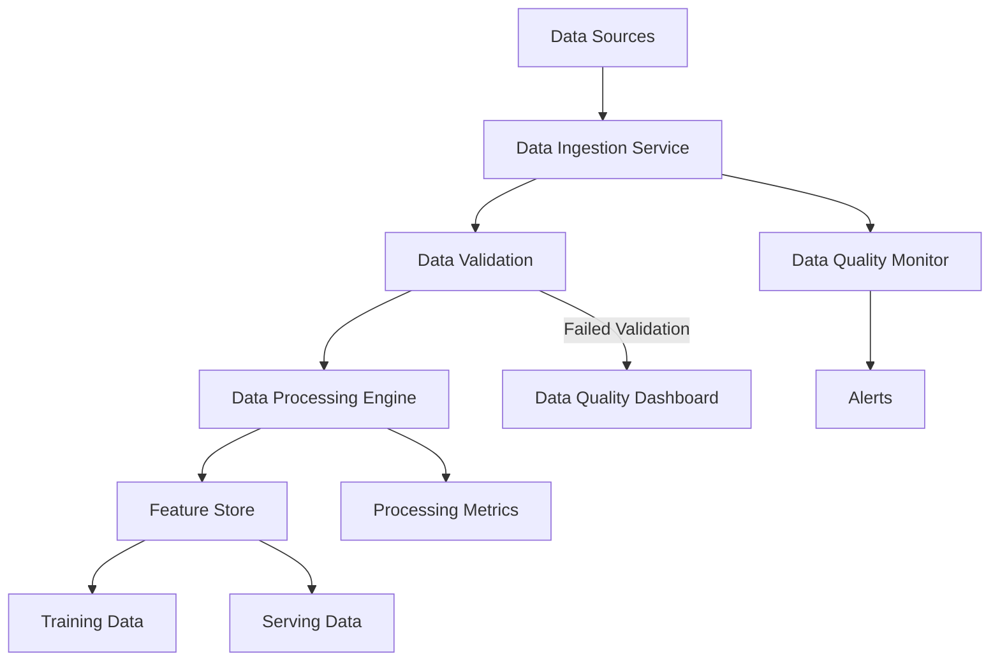
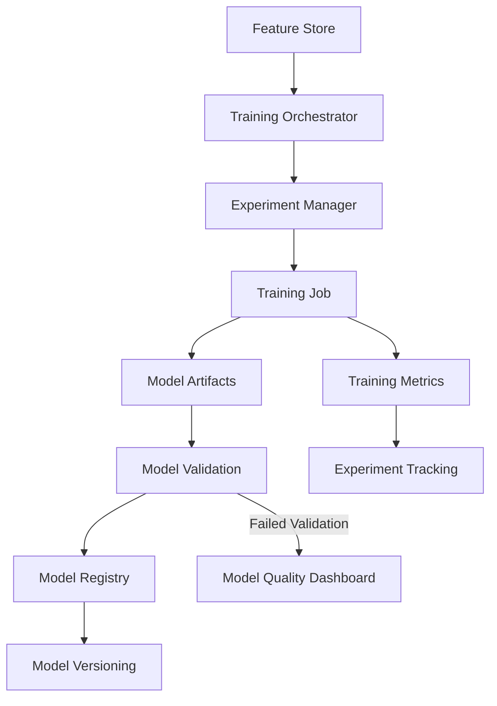
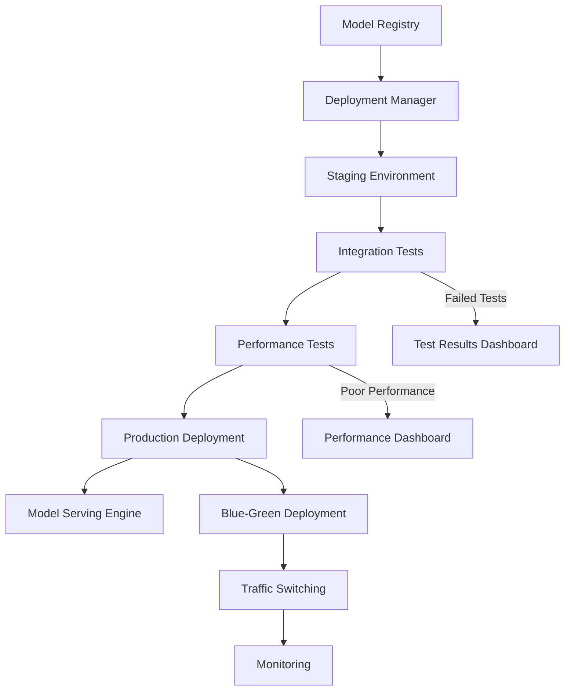
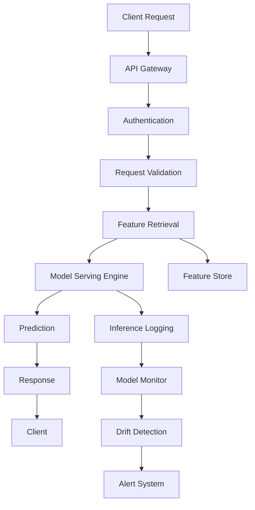
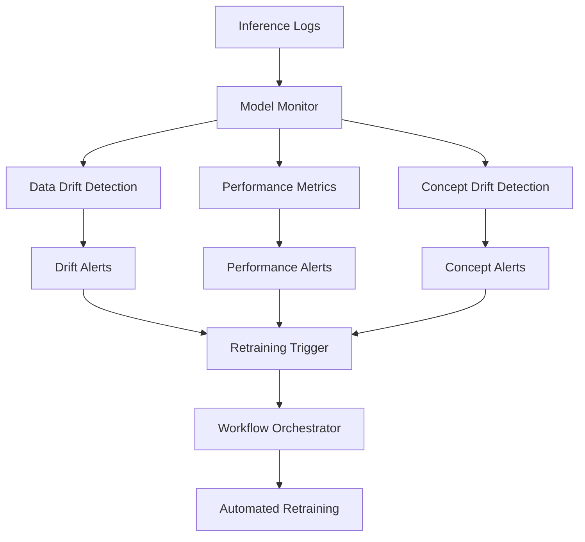
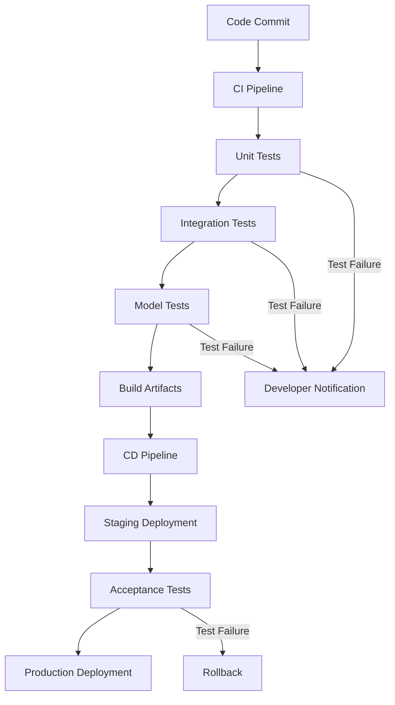
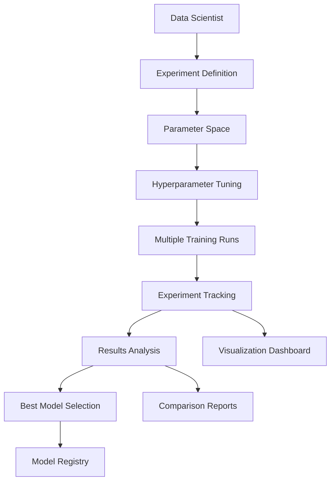

# ML Lifecycle Workflows

## Overview

This document describes the key workflows in the MLOps Management System, showing how components interact to deliver end-to-end machine learning capabilities.

## 1. Data Pipeline Workflow

### Steps:
1. **Data Ingestion**: Raw data collected from various sources
2. **Validation**: Data quality checks and schema validation
3. **Processing**: Feature engineering and data transformation
4. **Storage**: Processed features stored in Feature Store
5. **Monitoring**: Continuous data quality monitoring

## 2. Model Training Workflow

### Steps:
1. **Data Preparation**: Features retrieved from Feature Store
2. **Experiment Setup**: Training configuration and hyperparameters
3. **Training Execution**: Distributed training job execution
4. **Model Validation**: Automated model quality checks
5. **Registration**: Valid models stored in Model Registry

## 3. Model Deployment Workflow

### Steps:
1. **Model Selection**: Choose model version from registry
2. **Staging Deployment**: Deploy to staging environment
3. **Testing**: Automated integration and performance tests
4. **Production Deployment**: Blue-green or canary deployment
5. **Monitoring**: Continuous performance monitoring

## 4. Inference Workflow

### Steps:
1. **Request Handling**: API Gateway receives and routes requests
2. **Authentication**: User/API key validation
3. **Feature Enrichment**: Real-time feature retrieval
4. **Inference**: Model prediction generation
5. **Monitoring**: Log predictions for drift detection

## 5. Model Monitoring Workflow

### Steps:
1. **Data Collection**: Inference data and performance metrics
2. **Drift Analysis**: Statistical analysis of data and concept drift
3. **Alert Generation**: Automated alerts for anomalies
4. **Retraining Decision**: Automated or manual retraining trigger
5. **Workflow Execution**: Automated retraining pipeline

## 6. CI/CD Pipeline Workflow

### Steps:
1. **Source Control**: Code changes trigger CI pipeline
2. **Testing**: Comprehensive automated testing suite
3. **Build**: Create deployment artifacts
4. **Deployment**: Staged deployment with validation
5. **Monitoring**: Post-deployment health checks

## 7. Experiment Management Workflow

### Steps:
1. **Experiment Design**: Define objectives and parameter space
2. **Execution**: Run multiple experiments with different configurations
3. **Tracking**: Log metrics, parameters, and artifacts
4. **Analysis**: Compare results and identify best performing models
5. **Promotion**: Move best models to production pipeline

## Cross-Cutting Concerns

### Security Workflow
- **Authentication**: OAuth2/OIDC integration
- **Authorization**: RBAC enforcement at API level
- **Audit**: Comprehensive logging of all operations
- **Secrets**: Secure secret management and rotation

### Observability Workflow
- **Metrics**: System and business metrics collection
- **Logging**: Centralized log aggregation and analysis
- **Tracing**: Distributed tracing across services
- **Alerting**: Proactive issue detection and notification